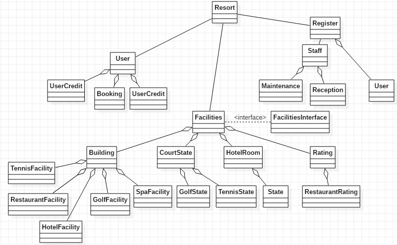

#
Purpose of project
##
Introduction
###
This will be a program designed to manage bookings and a credit 
system usable only for resort related services and its facilities. 

The program will have functions which will (incomplete list)
- Allow bookings to be made via hotel reception
- Allow for credit to be added for purchases on the resort at 5% discount
- Allow for registration of new users or employees

On completion of the project the project will having all the usual resort related
functions commonly found including the need for maintenance if necessary, applying to
all necessary resort facilities.

